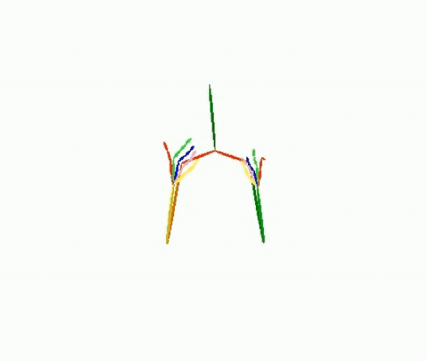
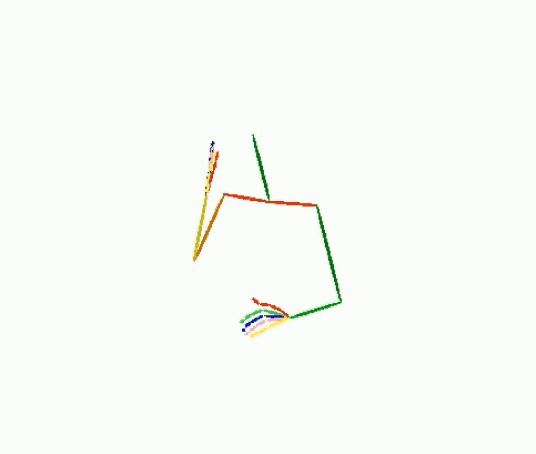
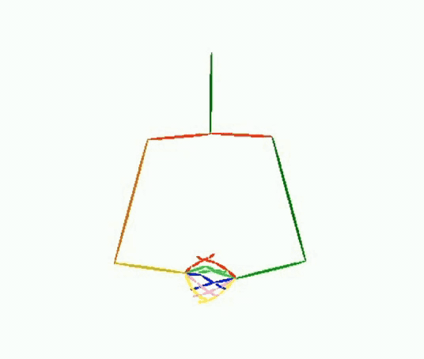
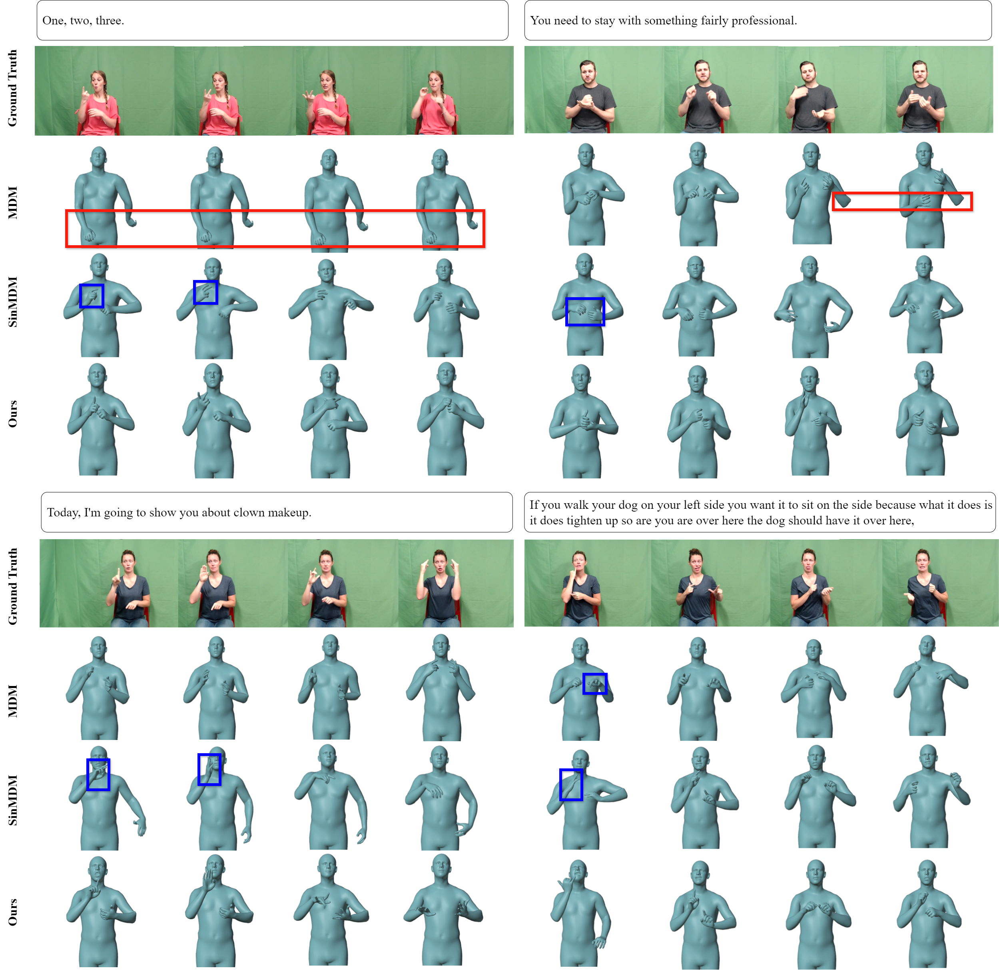
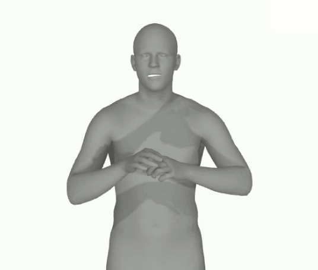

# SIGN LANGUAGE PRODUCTION (Demo)
<!-- ## Quick Start -->
<!--  -->

## Quick comparison to SOTA methods
### Quantitative evaluation

<i>Table 1: Back translation results on the RWTH-PHOENIX Weather-2014T
(PHOENIX14T) dataset for the Text to Pose task

| **Model**    |**ROUGH-L ⬆️**|**BLEU-1 ⬆️**|**BLEU-2 ⬆️**|**BLEU-3 ⬆️**|**BLEU-4 ⬆️**|
| ------------ | ------------ | ------------ | ------------ | ------------ |  ------------ |
|Ground truth           | $26.86$ | $27.64$ | $18.09$  |  $13.34$  |  $10.71$ |
|PT           | $11.65$ | $12.38$ | $5.70$  |  $3.65$  |  $2.74$ |
|MDM           | $21.50$ | $23.26$ | $14.47$  |  $10.31$  |  $7.93$ |
|SinMDM           | $19.42$ | $22.10$ | $12.83$  |  $8.57$  |  $6.28$ |
|*Ours          | $$\textcolor{orange}{24.15}$$ | $$\textcolor{orange}{26.37}$$ | $$\textcolor{orange}{16.78}$$ |  $$\textcolor{orange}{11.85}$$  |  $$\textcolor{orange}{9.03}$$ |

<!-- 
<i>Table 2: Quantitative results on the <u>HumanML3D</u> test set</i> (diffusion steps = 1000)
 -->

<i>Table 2: Back translation results on the How2Sign dataset for the Text to Pose task

| **Model**    |**ROUGH-L ⬆️**|**BLEU-1 ⬆️**|**BLEU-2 ⬆️**|**BLEU-3 ⬆️**|**BLEU-4 ⬆️**|
| ------------ | ------------ | ------------ | ------------ | ------------ |  ------------ |
|Ground truth           | $17.54$ | $22.15$ | $11.01$  |  $6.47$  |  $3.91$ |
|MDM           | $15.53$ | $18.06$ | $8.27$  |  $4.68$  |  $2.58$ |
|SinMDM           | $16.10$ | $19.74$ | $9.37$  |  $5.40$  |  $3.15$ |
|*Ours          | $$\textcolor{orange}{16.82}$$ | $$\textcolor{orange}{19.65}$$ | $$\textcolor{orange}{9.50}$$ |  $$\textcolor{orange}{5.51}$$  |  $$\textcolor{orange}{3.33}$$ |

### Qualitative evaluation

<b>PHOENIX14T</b>

<table class="fixed">
  <colgroup>
    <col span="6" style="width: 120px;">
  </colgroup>
  <tr>
    <td><strong>Text</strong></td>
    <td><em>am freitag ist es im südwesten zunächst freundlich
    </td>
    <td><em>und etwas kälter wird es dann im laufe des sonntags von osten
    </td>
    <td><em>und nun die wettervorhersage für morgen mittwoch den siebenundzwanzigsten januar</td>
    <td><em>am tag neunzehn grad an der nordsee und sechsundzwanzig grad in teilen thüringens und sachsens
    </td>
    <td><em>morgen vormittag an der ostsee noch starke böen sonst weht der wind schwach bis mäßig aus ost bis südost
    </td>
  </tr>
  <tr>
    <td><strong>Ground Truth</strong></td>
    <td></td>
    <td></td>
    <td></td>
    <td></td>
    <td></td>
  </tr>
  <tr>
    <td><strong>Ours</strong></td>
    <td></td>
    <td></td>
    <td></td>
    <td></td>
    <td></td>
  </tr>
</table>

<b>HOW2SIGN</b>

<table class="fixed">
  <colgroup>
    <col span="6" style="width: 120px;">
  </colgroup>
  <tr>
    <td><strong>Text</strong></td>
    <td><em>We got our martini glass and a strainer.</td>
    <td><em>So I'm going to toss it to Ryan; he's going to set it up for a foot brush for me.</td>
    <td><em>I'm trying to define the edges and then kinda just dry-brush it to fill it in a little bit.</td>
    <td><em>Then begin the posture and the movement is what we're going to do, which is gathering chi from heaven and earth.</td>
    <td><em>Okay, so now that I have this pressed down, I'm going to go ahead and flip these pants back out, because I need to see that excess fabric, so I can determine where I'm going to cut it off.</td>
  </tr>
  <tr>
    <td><strong>Ground Truth</strong></td>
    <td></td>
    <td></td>
    <td></td>
    <td></td>
    <td></td>
  </tr>
  <tr>
    <td><strong>Ours</strong></td>
    <td></td>
    <td></td>
    <td></td>
    <td></td>
    <td></td>
  </tr>
</table>

## Acknowledgments

This code is standing on the shoulders of giants. We want to thank the following contributors
that our code is based on:

[motion-diffusion-model](https://github.com/GuyTevet/motion-diffusion-model), [guided-diffusion](https://github.com/openai/guided-diffusion), [MotionCLIP](https://github.com/GuyTevet/MotionCLIP), [text-to-motion](https://github.com/EricGuo5513/text-to-motion), [actor](https://github.com/Mathux/ACTOR), [joints2smpl](https://github.com/wangsen1312/joints2smpl), [MoDi](https://github.com/sigal-raab/MoDi).
